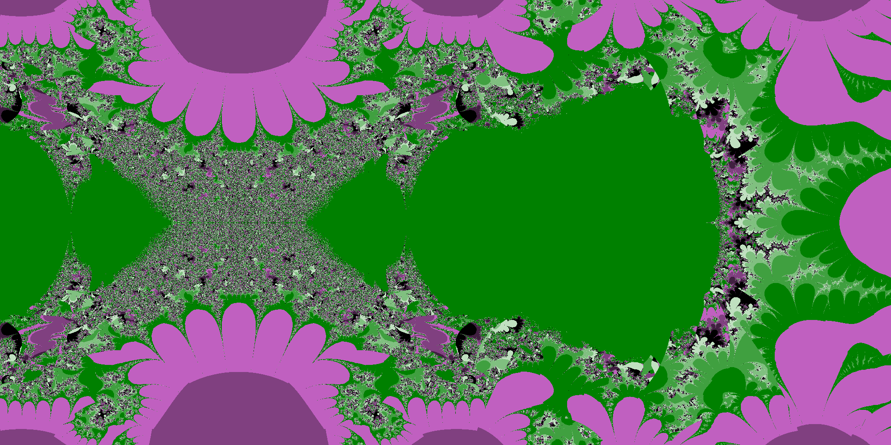
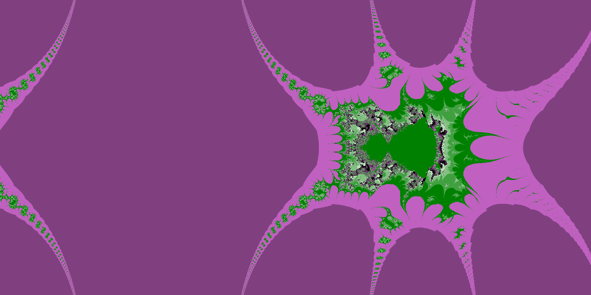
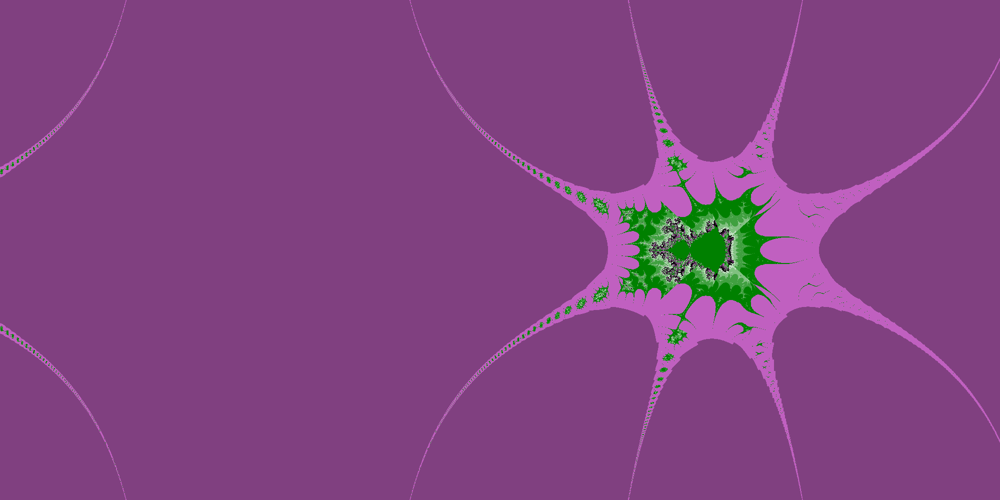

<h1>Fractal<h1>

<h4>I did this mostly out of practice and curiosity because what fractals are is quite an interesting topic</h4>
<h4>
the fractal you are seeing is based on a mandelbrot set which is quite an interesting theme
</h4>
<h4>
If you want to find more information you can go to <a href="https://en.wikipedia.org/wiki/Mandelbrot_set">wikipedia</a></h4>
<h1>my own fractal<h1>
| x1 zoom| x2 zoom | x3 zoom |
|--------|---------|---------|
|  |  | 
